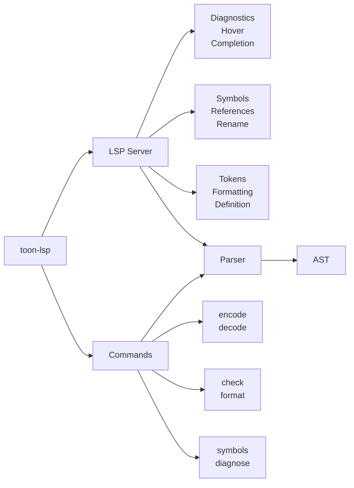

# `toon-lsp`

[](https://github.com/w0wl0lxd/toon-lsp/actions/workflows/ci.yml)
[](https://github.com/w0wl0lxd/toon-lsp/releases)
[](https://www.rust-lang.org/)
[](LICENSE)
[](LICENSING.md)

A Language Server Protocol (LSP) implementation for [TOON](https://github.com/toon-format/toon) `(Token-Oriented Object Notation)`.

## Overview

`TOON` is a compact, human-readable encoding of the JSON data model designed for LLM prompts. This project provides:

- **Full AST with source positions** - Parse TOON into an abstract syntax tree with span information
- **LSP Server** - Complete language server for IDE integration with 9 LSP features
- **CLI Tools** - 6 commands for encoding, decoding, validation, formatting, and analysis
- **Error recovery** - Partial parsing for better IDE experience
- **Comprehensive tests** - 467+ tests covering scanner, parser, LSP, and CLI

## Features

### Parser
- [x] Lexer/Scanner with position tracking
- [x] Full TOON spec parser (objects, arrays, primitives)
- [x] Expanded arrays (dash-prefixed items)
- [x] Inline arrays (`key[count]: val1,val2,val3`)
- [x] Tabular arrays (`key[count]{col1,col2}:`)
- [x] Error recovery for partial documents
- [x] AST with complete span information

### LSP Features
- [x] Diagnostics (syntax errors with recovery)
- [x] Document symbols (outline with hierarchy)
- [x] Hover information (type and path display)
- [x] Go to definition (duplicate key navigation)
- [x] Completions (sibling keys, boolean values)
- [x] Semantic tokens (syntax highlighting)
- [x] Find references (key usage navigation)
- [x] Rename symbol (refactor keys across document)
- [x] Formatting (configurable indentation)

### CLI Commands
- [x] `encode` - Convert JSON/YAML to TOON
- [x] `decode` - Convert TOON to JSON/YAML
- [x] `check` - Validate TOON syntax
- [x] `format` - Format TOON files
- [x] `symbols` - Extract document symbols
- [x] `diagnose` - Structured diagnostics output

## Installation

```bash
cargo install toon-lsp
```

Or build from source:

```bash
git clone https://github.com/w0wl0lxd/toon-lsp
cd toon-lsp
cargo build --release
```

## CLI Usage

### `encode` - Convert JSON/YAML to TOON

```bash
# Convert JSON to TOON
toon-lsp encode config.json -o config.toon

# Convert YAML to TOON
toon-lsp encode config.yaml -o config.toon

# From stdin
echo '{"name": "Alice", "age": 30}' | toon-lsp encode -

# With custom indentation
toon-lsp encode data.json --indent 4
```

**Options:**
- `-o, --output <FILE>` - Output file (stdout if omitted)
- `-f, --input-format <json|yaml>` - Input format (auto-detected from extension)
- `-i, --indent <N>` - Indentation size (default: 2)
- `--tabs` - Use tabs instead of spaces

### `decode` - Convert TOON to JSON/YAML

```bash
# Convert TOON to JSON
toon-lsp decode config.toon -o config.json

# Convert TOON to YAML
toon-lsp decode config.toon --format yaml

# Pretty-print JSON
toon-lsp decode data.toon --pretty

# From stdin
echo 'name: Alice' | toon-lsp decode -
```

**Options:**
- `-o, --output <FILE>` - Output file (stdout if omitted)
- `-f, --output-format <json|yaml>` - Output format (default: json)
- `-p, --pretty` - Pretty-print JSON output

### `check` - Validate TOON Syntax

```bash
# Check single file
toon-lsp check config.toon

# Check multiple files
toon-lsp check *.toon

# JSON output for tooling
toon-lsp check config.toon --format json

# GitHub Actions annotations
toon-lsp check config.toon --format github

# From stdin
echo 'key: value' | toon-lsp check -
```

**Options:**
- `-f, --format <text|json|github>` - Output format (default: text)
- `-s, --severity <error|warning|info|hint>` - Minimum severity (default: error)

**Exit Codes:**
- `0` - Valid TOON
- `1` - I/O error
- `2` - Validation errors found

### `format` - Format TOON Files

```bash
# Format to stdout
toon-lsp format config.toon

# Format in place
toon-lsp format config.toon -o config.toon

# Check if file needs formatting (CI mode)
toon-lsp format --check config.toon

# Custom indentation
toon-lsp format config.toon --indent 4

# Use tabs
toon-lsp format config.toon --tabs
```

**Options:**
- `-o, --output <FILE>` - Output file (stdout if omitted)
- `-i, --indent <N>` - Indentation size (default: 2)
- `--tabs` - Use tabs instead of spaces
- `--check` - Check formatting without modifying (exit 1 if unformatted)

### `symbols` - Extract Document Symbols

```bash
# Tree view (default)
toon-lsp symbols config.toon
# Output:
#   server
#     host
#     port
#   database
#     url

# JSON output for tooling
toon-lsp symbols config.toon --format json

# Flat list with dot notation
toon-lsp symbols config.toon --format flat
# Output:
#   server
#   server.host
#   server.port

# Show types
toon-lsp symbols config.toon --types
# Output:
#   server [object]
#     host [string]
#     port [number]

# Show positions
toon-lsp symbols config.toon --positions
# Output:
#   server  (L1:C1)
#     host  (L2:C3)
```

**Options:**
- `-f, --format <tree|json|flat>` - Output format (default: tree)
- `-t, --types` - Show value types
- `-p, --positions` - Show line:column positions

### `diagnose` - Structured Diagnostics

```bash
# JSON diagnostics (default)
toon-lsp diagnose config.toon

# SARIF format for security tools
toon-lsp diagnose config.toon --format sarif

# Include source context
toon-lsp diagnose config.toon --context

# Filter by severity
toon-lsp diagnose config.toon --severity warning
```

**Options:**
- `-f, --format <json|sarif>` - Output format (default: json)
- `-c, --context` - Include source code context
- `-s, --severity <error|warning|info|hint>` - Minimum severity (default: error)

**JSON Output:**
```json
{
  "file": "config.toon",
  "diagnostics": [
    {
      "range": {"start": {"line": 5, "character": 3}, "end": {"line": 5, "character": 10}},
      "severity": "error",
      "code": "E004",
      "message": "expected value",
      "source": "toon-lsp"
    }
  ],
  "summary": {"error_count": 1, "warning_count": 0, "hint_count": 0}
}
```

**SARIF Output:** Compliant with [SARIF 2.1.0](https://sarifweb.azurewebsites.net/) for integration with GitHub Code Scanning, VS Code SARIF Viewer, and other security tools.

### LSP Server

Start the language server (communicates over stdio):

```bash
toon-lsp
# or explicitly:
toon-lsp lsp
```

## Library Usage

```rust
use toon_lsp::{parse, AstNode, ObjectEntry};

fn main() -> Result<(), Box<dyn std::error::Error>> {
    let source = r#"
user:
  name: Alice
  age: 30
  roles[2]:
    - admin
    - developer
"#;

    let ast = parse(source)?;

    // Pattern match with let-else (Rust 2024 idiom)
    let AstNode::Document { children, span } = &ast else {
        return Ok(());
    };

    println!("Document spans lines {}-{}", span.start.line + 1, span.end.line + 1);

    // Functional iteration with pattern matching
    children
        .iter()
        .filter_map(|node| match node {
            AstNode::Object { entries, .. } => Some(entries),
            _ => None,
        })
        .flatten()
        .for_each(|entry| print_entry(entry, 0));

    Ok(())
}

fn print_entry(entry: &ObjectEntry, depth: usize) {
    let indent = "  ".repeat(depth);
    let pos = &entry.key_span.start;

    println!("{indent}{}: L{}:C{}", entry.key, pos.line + 1, pos.column + 1);

    // Recursive descent into nested objects
    if let AstNode::Object { entries, .. } = &entry.value {
        entries.iter().for_each(|e| print_entry(e, depth + 1));
    }
}
```

**Error recovery for IDEs** — parsing succeeds even with syntax errors:

```rust
use toon_lsp::parse_with_errors;

let (ast, errors) = parse_with_errors(source);

// IDE features work with partial AST
if let Some(ref ast) = ast {
    // Completions, hover, symbols available despite errors
}

// Errors include spans for diagnostic rendering
errors.iter().for_each(|err| {
    eprintln!(
        "L{}:C{}: {}",
        err.span.start.line + 1,
        err.span.start.column + 1,
        err.kind
    );
});
```

## Architecture



## Development

```bash
cargo build                      # Build the project
cargo test                       # Run all 467+ tests
cargo clippy -- -D warnings      # Lint with warnings as errors
cargo fmt --check                # Check formatting
RUST_LOG=debug cargo run         # Run LSP server with debug logging
```

## Related Projects

- [toon-format/toon](https://github.com/toon-format/toon) - Official TOON specification
- [toon-format/toon-rust](https://github.com/toon-format/toon-rust) - Rust implementation (serde-based)
- [tower-lsp](https://github.com/ebkalderon/tower-lsp) - LSP framework used by this project

## Contributing

Contributions are welcome! Please see [CONTRIBUTING.md](CONTRIBUTING.md) for guidelines.

All contributions require a DCO sign-off (`git commit -s`).

## License

**Dual Licensed**: AGPL-3.0-only OR Commercial

- **Open Source**: [AGPL-3.0](LICENSE) - Free for open source and personal use
- **Commercial**: Available for proprietary use - See [LICENSING.md](LICENSING.md)

| Use Case | License |
|----------|---------|
| Personal/internal development | Free (AGPL) |
| Open source project (AGPL-compatible) | Free (AGPL) |
| Proprietary IDE/editor embedding | Commercial required |
| Cloud IDE / SaaS platform | Commercial required |

Contact: w0wl0lxd@tuta.com | [GitHub Discussions](https://github.com/w0wl0lxd/toon-lsp/discussions)
