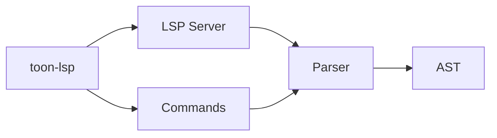

# `toon-lsp`

[](https://github.com/w0wl0lxd/toon-lsp/actions/workflows/ci.yml)
[](https://github.com/w0wl0lxd/toon-lsp/releases)
[](https://www.rust-lang.org/)
[](LICENSE)
[](LICENSING.md)

a language server protocol implementation for [toon](https://github.com/toon-format/toon) (token-oriented object notation). toon is a compact config format designed to be easy for both humans and lms to read/write.

## what's in this crate

- full parser with position tracking on every node
- 9 lsp features: diagnostics, hover, completion, go-to-definition, find-references, rename, semantic tokens, document symbols, formatting
- 6 cli commands: encode, decode, check, format, symbols, diagnose
- error recovery so the parser keeps going even when your file has syntax errors
- 467+ tests covering the scanner, parser, lsp, and cli

## the lsp features

- diagnostics with syntax error recovery
- document symbols (outline view)
- hover info (shows type and path)
- completions (sibling keys, true/false)
- go-to-definition for duplicate keys
- semantic tokens (syntax highlighting)
- find-references
- rename symbol
- code actions and formatting

## cli

### encode - json/yaml to toon

```bash
toon-lsp encode config.json -o config.toon
toon-lsp encode config.yaml -o config.toon
echo '{"name": "Alice"}' | toon-lsp encode -
toon-lsp encode data.json --indent 4
```

### decode - toon to json/yaml

```bash
toon-lsp decode config.toon -o config.json
toon-lsp decode config.toon --format yaml
toon-lsp decode data.toon --pretty
echo 'name: Alice' | toon-lsp decode -
```

### check - validate toon syntax

```bash
toon-lsp check config.toon
toon-lsp check *.toon
toon-lsp check config.toon --format json
toon-lsp check config.toon --format github
echo 'key: value' | toon-lsp check -
```

exit codes: 0 = valid, 1 = io error, 2 = validation errors

### format - format toon files

```bash
toon-lsp format config.toon                    # stdout
toon-lsp format config.toon -o config.toon     # in place
toon-lsp format --check config.toon            # ci mode, exit 1 if unformatted
toon-lsp format config.toon --indent 4
toon-lsp format config.toon --tabs
```

### symbols - extract document outline

```bash
toon-lsp symbols config.toon                  # tree view (default)
toon-lsp symbols config.toon --format json     # json for tooling
toon-lsp symbols config.toon --format flat     # dot notation paths
toon-lsp symbols config.toon --types         # show types
toon-lsp symbols config.toon --positions     # show line:col
```

### diagnose - structured error output

```bash
toon-lsp diagnose config.toon                # json (default)
toon-lsp diagnose config.toon --format sarif # security tool format
toon-lsp diagnose config.toon --context      # include source lines
toon-lsp diagnose config.toon --severity warning
```

## using as a library

```rust
use toon_lsp::{parse, AstNode, ObjectEntry};

fn main() -> Result<(), Box<dyn std::error::Error>> {
    let source = r#"
user:
  name: Alice
  age: 30
  roles[2]:
    - admin
    - developer
"#;

    let ast = parse(source)?;

    let AstNode::Document { children, span } = &ast else {
        return Ok(());
    };

    println!("Document spans lines {}-{}", span.start.line + 1, span.end.line + 1);

    children
        .iter()
        .filter_map(|node| match node {
            AstNode::Object { entries, .. } => Some(entries),
            _ => None,
        })
        .flatten()
        .for_each(|entry| print_entry(entry, 0));

    Ok(())
}

fn print_entry(entry: &ObjectEntry, depth: usize) {
    let indent = "  ".repeat(depth);
    let pos = &entry.key_span.start;
    println!("{indent}{}: L{}:C{}", entry.key, pos.line + 1, pos.column + 1);

    if let AstNode::Object { entries, .. } = &entry.value {
        entries.iter().for_each(|e| print_entry(e, depth + 1));
    }
}
```

error recovery for ide use:

```rust
use toon_lsp::parse_with_errors;

let (ast, errors) = parse_with_errors(source);

if let Some(ref ast) = ast {
    // completions, hover, symbols work even with errors
}

for err in &errors {
    eprintln!("L{}:C{}: {}",
        err.span.start.line + 1,
        err.span.start.column + 1,
        err.kind);
}
```

## architecture


```mermaid
flowchart LR
    CLI[toon-lsp] --> LSP[LSP Server]
    CLI --> CMD[Commands]

    LSP --> P[Parser]
    CMD --> P
    P --> AST[AST]
```

## dev setup

```bash
cargo build
cargo test
cargo clippy -- -D warnings
cargo fmt --check
RUST_LOG=debug cargo run
```

## related

- [toon-format/toon](https://github.com/toon-format/toon) - spec
- [toon-format/toon-rust](https://github.com/toon-format/toon-rust) - serde-based rust lib
- [tower-lsp](https://github.com/ebkalderon/tower-lsp) - lsp framework

## license

dual licensed:

- **agpl-3.0** - open source and personal use
- **commercial** - for proprietary embedding (see [licensing.md](LICENSING.md))

questions? w0wl0lxd@tuta.com
