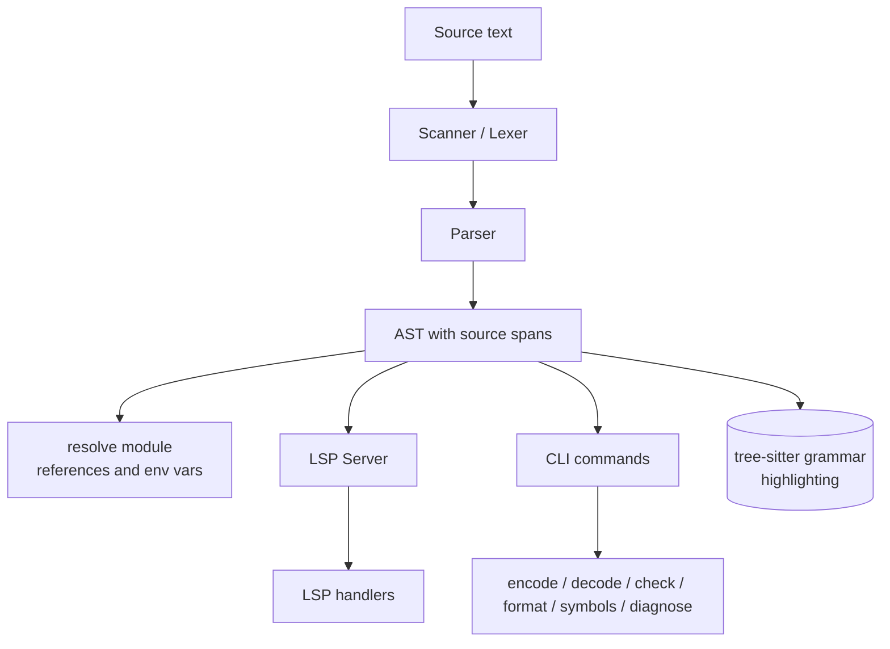

# `toon-lsp`

[](https://github.com/w0wl0lxd/toon-lsp/actions/workflows/ci.yml)
[](https://github.com/w0wl0lxd/toon-lsp/actions/workflows/build-extensions.yml)
[](https://github.com/w0wl0lxd/toon-lsp/releases)
[](https://www.rust-lang.org/)
[](LICENSE)
[](LICENSING.md)

A [Language Server Protocol](https://microsoft.github.io/language-server-protocol/) implementation and command-line toolkit for [TOON](https://github.com/toon-format/toon) (Token-Oriented Object Notation), a compact, token-efficient, indentation-based encoding of the JSON data model designed for LLM prompts and other contexts where every token costs.

This project provides both a library (`toon_lsp`) that you can embed in your own tools, and a `toon-lsp` binary that runs as an LSP server or as a standalone CLI for converting, validating, formatting, and inspecting TOON documents.

TOON encodes the JSON data model with fewer tokens than JSON: indentation replaces braces, strings are quoted only when required, and arrays declare their length once (`[N]`). `toon-lsp` parses that syntax into an AST with source spans and serves it to editors (diagnostics, navigation, editing) and to the CLI. The parser performs error recovery, so it returns a partial AST for incomplete input rather than failing outright.

## Table of contents

- [Installation](#installation)
- [Editor support](#editor-support)
- [Language features](#language-features)
- [Language server features](#language-server-features)
- [Command-line interface](#command-line-interface)
- [Using the library](#using-the-library)
- [Architecture](#architecture)
- [Development](#development)
- [Related](#related)
- [License](#license)

## Installation

From crates.io:

```bash
cargo install toon-lsp
```

Build from source:

```bash
git clone https://github.com/w0wl0lxd/toon-lsp
cd toon-lsp
cargo build --release
# binary at target/release/toon-lsp
```

Run the LSP server by launching the binary with no subcommand; most editor integrations start it automatically (see below).

## Editor support

TOON is supported in 11 editors through bundled language-server wiring: VS Code, Neovim, Vim, Helix, Zed, Sublime Text, Kate, Emacs, JetBrains IDEs, Eclipse, and Notepad++. Setup instructions for each are in [`docs/ide-support.md`](docs/ide-support.md).

## Language features

`toon-lsp` parses the full TOON surface syntax:

- Line comments (`#`) and block comments (`/* ... */`, which may span lines).
- Triple-quoted block strings (`""" ... """`), which preserve newlines verbatim and do no escape processing.
- Hexadecimal integers (`0xFF`, `0x1f`, `-0x10`).
- References: `${path}` resolves a dotted path against the document; `${env:VAR}` reads the process environment. A reference may point at another reference; the resolver follows the chain and detects cycles so resolution always terminates.

  ```toon
  db:
    port: 5432
  service:
    db_port: ${db.port}        # resolves to 5432
    token: ${env:API_TOKEN}    # resolved from the environment
  ```

## Language server features

Diagnostics are published on document open and change. Because parsing recovers from errors, the handlers below also operate on documents that do not yet parse cleanly.

**Navigation and symbols**

- Go to definition (resolves duplicate-key references and reference chains)
- Document symbols (outline)
- Workspace symbols (fuzzy search across open documents)
- Find references
- Document highlight
- Selection ranges

**Editing**

- Rename, with `prepareRename` support
- Document formatting (skipped when the document has parse errors)
- Code actions
- Code lens
- Linked editing ranges (edit matching key/value pairs together)

**Information**

- Hover (shows type, path, and resolved reference values)
- Completion (sibling keys, `true`/`false`, structure)
- Folding ranges
- Inlay hints
- Document links
- Semantic tokens (`property`, `string`, `number`, `keyword`, `operator`, `variable`)

## Command-line interface

With no subcommand the binary runs as an LSP server. Otherwise it exposes six commands.

### `encode` — JSON/YAML to TOON

```bash
toon-lsp encode config.json -o config.toon
toon-lsp encode config.yaml -o config.toon
echo '{"name": "Alice"}' | toon-lsp encode -
toon-lsp encode data.json --indent 4
```

### `decode` — TOON to JSON/YAML

```bash
toon-lsp decode config.toon -o config.json
toon-lsp decode config.toon --format yaml
toon-lsp decode data.toon --pretty
echo 'name: Alice' | toon-lsp decode -
```

### `check` — validate TOON syntax

```bash
toon-lsp check config.toon
toon-lsp check *.toon
toon-lsp check config.toon --format json
toon-lsp check config.toon --format github
echo 'key: value' | toon-lsp check -
```

Exit codes: `0` = valid, `1` = I/O error, `2` = validation errors.

### `format` — format TOON files

```bash
toon-lsp format config.toon                    # stdout
toon-lsp format config.toon -o config.toon     # in place
toon-lsp format --check config.toon            # CI mode, exit 1 if unformatted
toon-lsp format config.toon --indent 4
toon-lsp format config.toon --tabs
```

### `symbols` — extract document outline

```bash
toon-lsp symbols config.toon                  # tree view (default)
toon-lsp symbols config.toon --format json     # JSON for tooling
toon-lsp symbols config.toon --format flat     # dot-notation paths
toon-lsp symbols config.toon --types           # show types
toon-lsp symbols config.toon --positions       # show line:col
```

### `diagnose` — structured error output

```bash
toon-lsp diagnose config.toon                # JSON (default)
toon-lsp diagnose config.toon --format sarif # SARIF for security tooling
toon-lsp diagnose config.toon --context      # include source lines
toon-lsp diagnose config.toon --severity warning
```

## Using the library

```rust
use toon_lsp::{parse, AstNode, ObjectEntry};

fn main() -> Result<(), Box<dyn std::error::Error>> {
    let source = r#"
user:
  name: Alice
  age: 30
  roles[2]:
    - admin
    - developer
"#;

    let ast = parse(source)?;

    let AstNode::Document { children, span } = &ast else {
        return Ok(());
    };

    println!("Document spans lines {}-{}", span.start.line + 1, span.end.line + 1);

    children
        .iter()
        .filter_map(|node| match node {
            AstNode::Object { entries, .. } => Some(entries),
            _ => None,
        })
        .flatten()
        .for_each(|entry| print_entry(entry, 0));

    Ok(())
}

fn print_entry(entry: &ObjectEntry, depth: usize) {
    let indent = "  ".repeat(depth);
    let pos = &entry.key_span.start;
    println!("{indent}{}: L{}:C{}", entry.key, pos.line + 1, pos.column + 1);

    if let AstNode::Object { entries, .. } = &entry.value {
        entries.iter().for_each(|e| print_entry(e, depth + 1));
    }
}
```

`parse_with_errors` returns a best-effort AST together with the diagnostics it collected, so callers can operate on partially valid input:

```rust
use toon_lsp::parse_with_errors;

let (ast, errors) = parse_with_errors(source);

if let Some(ref ast) = ast {
    // the AST is present even when `errors` is non-empty
}

for err in &errors {
    eprintln!(
        "L{}:C{}: {}",
        err.span.start.line + 1,
        err.span.start.column + 1,
        err.kind
    );
}
```

To resolve `${path}` / `${env:VAR}` references, use the `resolve` module:

```rust
use toon_lsp::{parse, resolve::resolve};

let ast = parse("foo:\n  bar: 42\nref: ${foo.bar}").unwrap();
let resolved = resolve(&ast, "foo.bar").unwrap(); // ResolvedRef::Node { .. }
```

## Architecture


```mermaid
flowchart TD
    SRC[Source text] --> SC[Scanner / Lexer]
    SC --> P[Parser]
    P --> AST[AST with source spans]

    AST --> RES["resolve module<br/>references and env vars"]
    AST --> SRV[LSP Server]
    AST --> CLI[CLI commands]
    AST --> TS[("tree-sitter grammar<br/>highlighting")]

    SRV --> FEAT[LSP handlers]
    CLI --> CMDS[encode / decode / check / format / symbols / diagnose]
```

The scanner and parser track a source position on every node and continue past syntax errors, so the same `AstNode` tree feeds both the LSP server (diagnostics, navigation, editing, introspection) and the CLI commands. The `resolve` module navigates the tree for `${path}` references and the process environment for `${env:VAR}`, with cycle detection. Editor highlighting is provided by a separate tree-sitter grammar that mirrors the Rust parser's node shapes.

## Development

Requires Rust 1.85 or newer (edition 2024). The repository pins a nightly toolchain via `rust-toolchain.toml`; CI also builds on nightly.

```bash
cargo build
cargo test
cargo clippy --all-features -- -D warnings
cargo fmt --all -- --check
RUST_LOG=debug cargo run
```

Tests cover the scanner, parser, reference resolver, LSP handlers, and CLI. The tree-sitter grammar has its own corpus under `editors/shared/tree-sitter-toon/test/corpus`, exercised by `tree-sitter test`.

## Related

- [toon-format/toon](https://github.com/toon-format/toon) — the TOON specification and SDKs
- [toon-format/spec](https://github.com/toon-format/spec) — the authoritative TOON spec
- [tower-lsp](https://github.com/ebkalderon/tower-lsp) — the LSP framework this server is built on

## License

Dual licensed:

- **AGPL-3.0-only** — open source and personal use
- **Commercial** — for proprietary embedding (see [LICENSING.md](LICENSING.md))

Questions: w0wl0lxd@tuta.com
