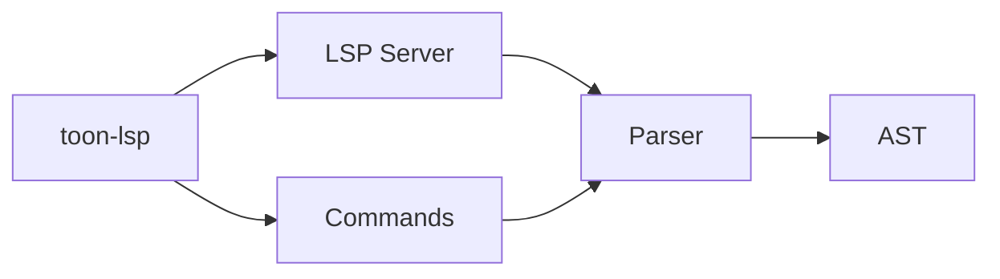

# `toon-lsp`

[](https://github.com/w0wl0lxd/toon-lsp/actions/workflows/ci.yml)
[](https://github.com/w0wl0lxd/toon-lsp/releases)
[](https://www.rust-lang.org/)
[](LICENSE)
[](LICENSING.md)

A [Language Server Protocol](https://microsoft.github.io/language-server-protocol/) implementation and command-line toolkit for [TOON](https://github.com/toon-format/toon) (Token-Oriented Object Notation), a compact, indentation-based config format.

This project provides both a library (`toon_lsp`) that you can embed in your own tools, and a `toon-lsp` binary that runs as an LSP server or as a standalone CLI for converting, validating, and inspecting TOON documents.

## Installation

From crates.io:

```bash
cargo install toon-lsp
```

Build from source:

```bash
git clone https://github.com/w0wl0lxd/toon-lsp
cd toon-lsp
cargo build --release
# binary at target/release/toon-lsp
```

Run the LSP server by launching the binary with no subcommand; most editor integrations start it automatically (see below).

## Editor support

TOON is supported in 11 editors through bundled language-server wiring: VS Code, Neovim, Vim, Helix, Zed, Sublime Text, Kate, Emacs, JetBrains IDEs, Eclipse, and Notepad++. Setup instructions for each are in [`docs/ide-support.md`](docs/ide-support.md).

## Language server features

The server advertises the following LSP capabilities. Diagnostics are published on document open and change, and the parser recovers from syntax errors so that other features keep working on incomplete files.

**Navigation and symbols**

- Go to definition (resolves duplicate-key references)
- Document symbols (outline)
- Workspace symbols (fuzzy search across open documents)
- Find references
- Selection ranges
- Document highlight

**Editing**

- Rename, with `prepareRename` support
- Document formatting (skipped when the document has parse errors)
- Code actions
- Code lens
- Linked editing ranges (edit matching key/value pairs together)

**Understanding and introspection**

- Hover (shows type and path)
- Completion (sibling keys, `true`/`false`, structure)
- Folding ranges
- Inlay hints
- Document links
- Semantic tokens (property, string, number, keyword, operator)

## Command-line interface

With no subcommand the binary runs as an LSP server. Otherwise it exposes six commands.

### `encode` — JSON/YAML to TOON

```bash
toon-lsp encode config.json -o config.toon
toon-lsp encode config.yaml -o config.toon
echo '{"name": "Alice"}' | toon-lsp encode -
toon-lsp encode data.json --indent 4
```

### `decode` — TOON to JSON/YAML

```bash
toon-lsp decode config.toon -o config.json
toon-lsp decode config.toon --format yaml
toon-lsp decode data.toon --pretty
echo 'name: Alice' | toon-lsp decode -
```

### `check` — validate TOON syntax

```bash
toon-lsp check config.toon
toon-lsp check *.toon
toon-lsp check config.toon --format json
toon-lsp check config.toon --format github
echo 'key: value' | toon-lsp check -
```

Exit codes: `0` = valid, `1` = I/O error, `2` = validation errors.

### `format` — format TOON files

```bash
toon-lsp format config.toon                    # stdout
toon-lsp format config.toon -o config.toon     # in place
toon-lsp format --check config.toon            # CI mode, exit 1 if unformatted
toon-lsp format config.toon --indent 4
toon-lsp format config.toon --tabs
```

### `symbols` — extract document outline

```bash
toon-lsp symbols config.toon                  # tree view (default)
toon-lsp symbols config.toon --format json     # JSON for tooling
toon-lsp symbols config.toon --format flat     # dot-notation paths
toon-lsp symbols config.toon --types           # show types
toon-lsp symbols config.toon --positions       # show line:col
```

### `diagnose` — structured error output

```bash
toon-lsp diagnose config.toon                # JSON (default)
toon-lsp diagnose config.toon --format sarif # SARIF for security tooling
toon-lsp diagnose config.toon --context      # include source lines
toon-lsp diagnose config.toon --severity warning
```

## Using the library

```rust
use toon_lsp::{parse, AstNode, ObjectEntry};

fn main() -> Result<(), Box<dyn std::error::Error>> {
    let source = r#"
user:
  name: Alice
  age: 30
  roles[2]:
    - admin
    - developer
"#;

    let ast = parse(source)?;

    let AstNode::Document { children, span } = &ast else {
        return Ok(());
    };

    println!("Document spans lines {}-{}", span.start.line + 1, span.end.line + 1);

    children
        .iter()
        .filter_map(|node| match node {
            AstNode::Object { entries, .. } => Some(entries),
            _ => None,
        })
        .flatten()
        .for_each(|entry| print_entry(entry, 0));

    Ok(())
}

fn print_entry(entry: &ObjectEntry, depth: usize) {
    let indent = "  ".repeat(depth);
    let pos = &entry.key_span.start;
    println!("{indent}{}: L{}:C{}", entry.key, pos.line + 1, pos.column + 1);

    if let AstNode::Object { entries, .. } = &entry.value {
        entries.iter().for_each(|e| print_entry(e, depth + 1));
    }
}
```

Parsing recovers from errors so IDE features work on incomplete input:

```rust
use toon_lsp::parse_with_errors;

let (ast, errors) = parse_with_errors(source);

if let Some(ref ast) = ast {
    // completions, hover, and symbols work even with errors present
}

for err in &errors {
    eprintln!(
        "L{}:C{}: {}",
        err.span.start.line + 1,
        err.span.start.column + 1,
        err.kind
    );
}
```

## Architecture


```mermaid
flowchart LR
    CLI[toon-lsp] --> LSP[LSP Server]
    CLI --> CMD[Commands]

    LSP --> P[Parser]
    CMD --> P
    P --> AST[AST]
```

The parser tracks source positions on every node and continues past syntax errors. The AST is shared by both the LSP server and the CLI commands.

## Development

Requires Rust 1.85 or newer (edition 2024). The repository pins a nightly toolchain via `rust-toolchain.toml`; CI also builds on nightly.

```bash
cargo build
cargo test
cargo clippy --all-features -- -D warnings
cargo fmt --all -- --check
RUST_LOG=debug cargo run
```

The suite includes over 550 tests across the scanner, parser, LSP handlers, and CLI, plus a tree-sitter grammar with a corpus under `editors/shared/tree-sitter-toon/test/corpus`.

## Related

- [toon-format/toon](https://github.com/toon-format/toon) — the TOON specification
- [toon-format/toon-rust](https://github.com/toon-format/toon-rust) — serde-based Rust library
- [tower-lsp](https://github.com/ebkalderon/tower-lsp) — the LSP framework this server is built on

## License

Dual licensed:

- **AGPL-3.0-only** — open source and personal use
- **Commercial** — for proprietary embedding (see [LICENSING.md](LICENSING.md))

Questions: w0wl0lxd@tuta.com
