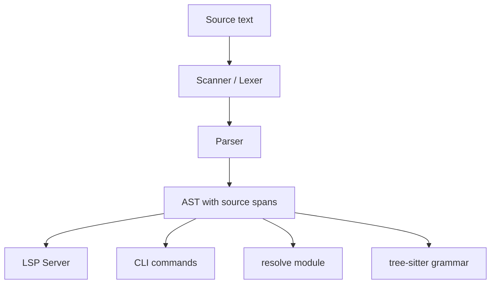

# toon-lsp

[](https://github.com/w0wl0lxd/toon-lsp/actions/workflows/ci.yml)
[](https://github.com/w0wl0lxd/toon-lsp/actions/workflows/build-extensions.yml)
[](https://github.com/w0wl0lxd/toon-lsp/releases)
[](https://www.rust-lang.org/)
[](LICENSE)

Parses, formats, and serves [TOON](https://github.com/toon-format/toon) (Token-Oriented Object Notation), a compact encoding of the JSON data model built for LLM prompts and config files.

The library (`toon_lsp`) embeds in your own tools. The `toon-lsp` binary runs as an LSP server or as a CLI for converting, validating, formatting, and inspecting TOON documents. The parser recovers from errors, so it returns a partial AST for incomplete input instead of failing.

## Contents

- [Why TOON](#why-toon)
- [Install](#install)
- [Quick start](#quick-start)
- [Language features](#language-features)
- [Editor support](#editor-support)
- [Language server features](#language-server-features)
- [Command-line interface](#command-line-interface)
- [Using the library](#using-the-library)
- [Architecture](#architecture)
- [Benchmarks](#benchmarks)
- [Development](#development)
- [Related](#related)
- [License](#license)

## Why TOON

TOON drops the quotes and braces that JSON needs, so documents are shorter to read and cheaper to send to a model. The same config in two encodings:

```toon
service:
  name: gateway
  port: 8080
  features: auth,rate-limit,metrics
```

```json
{
  "service": {
    "name": "gateway",
    "port": 8080,
    "features": ["auth", "rate-limit", "metrics"]
  }
}
```

On configs that carry real text, TOON is about 9% fewer bytes and 3% fewer GPT tokens than JSON, and clearly ahead of YAML and TOML. See [Benchmarks](#benchmarks) for the measured numbers and the one case where JSON still wins.

## Install

From crates.io:

```bash
cargo install toon-lsp
```

Build from source:

```bash
git clone https://github.com/w0wl0lxd/toon-lsp
cd toon-lsp
cargo build --release
# binary at target/release/toon-lsp
```

Run the LSP server by launching the binary with no subcommand. Most editor integrations start it automatically (see below).

## Quick start

```bash
# JSON or YAML in, TOON out
echo '{"name": "Alice", "age": 30}' | toon-lsp encode -

# TOON in, JSON out
echo 'name: Alice\nage: 30' | toon-lsp decode -

# Validate and format
toon-lsp check config.toon
toon-lsp format config.toon -o config.toon
```

## Language features

`toon-lsp` parses the full TOON surface syntax:

| Feature | Notes |
| --- | --- |
| Line and block comments | `#` and `/* ... */` (block comments span lines) |
| Triple-quoted block strings | `""" ... """` preserve newlines verbatim, no escape processing |
| Hexadecimal integers | `0xFF`, `0x1f`, `-0x10` |
| References | `${path}` resolves a dotted path in the document; `${env:VAR}` reads the process environment. A reference may point at another reference; the resolver follows the chain and detects cycles |

```toon
db:
  port: 5432
service:
  db_port: ${db.port}        # resolves to 5432
  token: ${env:API_TOKEN}    # resolved from the environment
```

## Editor support

TOON is supported in 11 editors through bundled language-server wiring: VS Code, Neovim, Vim, Helix, Zed, Sublime Text, Kate, Emacs, JetBrains IDEs, Eclipse, and Notepad++. Setup for each is in [`docs/ide-support.md`](docs/ide-support.md).

## Language server features

Diagnostics publish on document open and change. Because parsing recovers from errors, every handler below also works on documents that do not yet parse cleanly.

**Navigation and symbols**

| Feature | Notes |
| --- | --- |
| Go to definition | resolves duplicate-key references and reference chains |
| Document symbols | outline |
| Workspace symbols | fuzzy search across open documents |
| Find references | |
| Document highlight | |
| Selection ranges | |

**Editing**

| Feature | Notes |
| --- | --- |
| Rename | with `prepareRename` support |
| Document formatting | skipped when the document has parse errors |
| Code actions | for example, sort object keys alphabetically |
| Code lens | |
| Linked editing ranges | edit matching key/value pairs together |

**Information**

| Feature | Notes |
| --- | --- |
| Hover | shows type, path, and resolved reference values |
| Completion | sibling keys, `true`/`false`, structure |
| Folding ranges | |
| Inlay hints | |
| Document links | |
| Semantic tokens | `property`, `string`, `number`, `keyword`, `operator`, `variable` |

## Command-line interface

With no subcommand the binary runs as an LSP server. Otherwise it exposes six commands.

### encode: JSON/YAML to TOON

```bash
toon-lsp encode config.json -o config.toon
toon-lsp encode config.yaml -o config.toon
echo '{"name": "Alice"}' | toon-lsp encode -
toon-lsp encode data.json --indent 4
```

### decode: TOON to JSON/YAML

```bash
toon-lsp decode config.toon -o config.json
toon-lsp decode config.toon --format yaml
toon-lsp decode data.toon --pretty
echo 'name: Alice' | toon-lsp decode -
```

### check: validate TOON syntax

```bash
toon-lsp check config.toon
toon-lsp check *.toon
toon-lsp check config.toon --format json
toon-lsp check config.toon --format github
echo 'key: value' | toon-lsp check -
```

Exit codes: `0` = valid, `1` = I/O error, `2` = validation errors.

### format: format TOON files

```bash
toon-lsp format config.toon                    # stdout
toon-lsp format config.toon -o config.toon     # in place
toon-lsp format --check config.toon            # CI mode, exit 1 if unformatted
toon-lsp format config.toon --indent 4
toon-lsp format config.toon --tabs
```

### symbols: extract document outline

```bash
toon-lsp symbols config.toon                  # tree view (default)
toon-lsp symbols config.toon --format json     # JSON for tooling
toon-lsp symbols config.toon --format flat     # dot-notation paths
toon-lsp symbols config.toon --types           # show types
toon-lsp symbols config.toon --positions       # show line:col
```

### diagnose: structured error output

```bash
toon-lsp diagnose config.toon                # JSON (default)
toon-lsp diagnose config.toon --format sarif # SARIF for security tooling
toon-lsp diagnose config.toon --context      # include source lines
toon-lsp diagnose config.toon --severity warning
```

## Using the library

```rust
use toon_lsp::{parse, AstNode, ObjectEntry};

fn main() -> Result<(), Box<dyn std::error::Error>> {
    let source = "user:\n  name: Alice\n  age: 30";
    let ast = parse(source)?;

    let AstNode::Document { children, span } = &ast else {
        return Ok(());
    };

    println!("Document spans lines {}-{}", span.start.line + 1, span.end.line + 1);

    for node in children {
        if let AstNode::Object { entries, .. } = node {
            print_entry(&entries[0]);
        }
    }
    Ok(())
}

fn print_entry(entry: &ObjectEntry) {
    let pos = &entry.key_span.start;
    println!("{}: L{}:C{}", entry.key, pos.line + 1, pos.column + 1);
}
```

`parse_with_errors` returns a best-effort AST together with the diagnostics it collected, so callers can operate on partially valid input:

```rust
use toon_lsp::parse_with_errors;

let (ast, errors) = parse_with_errors(source);
if let Some(ref ast) = ast {
    // the AST is present even when `errors` is non-empty
}
for err in &errors {
    eprintln!("L{}:C{}: {}", err.span.start.line + 1, err.span.start.column + 1, err.kind);
}
```

To resolve `${path}` and `${env:VAR}` references, use the `resolve` module:

```rust
use toon_lsp::{parse, resolve::resolve};

let ast = parse("foo:\n  bar: 42\nref: ${foo.bar}").unwrap();
let resolved = resolve(&ast, "foo.bar").unwrap(); // ResolvedRef::Node { .. }
```

## Architecture

```text
        source text
            |
            v
   +------------------+
   | scanner          |  lexer: tracks a source position on every token
   +------------------+
            |
            v
   +------------------+
   | parser           |  recovers past errors, returns a partial AST
   +------------------+
            |
            v
   +------------------+
   | AST (spans)      |  one tree feeds the LSP server, the CLI,
   +------------------+  the resolve module, and the tree-sitter grammar
```

The scanner and parser track a source position on every node and continue past syntax errors, so a single `AstNode` tree feeds both the LSP server (diagnostics, navigation, editing, introspection) and the CLI commands. The `resolve` module walks the tree for `${path}` references and the process environment for `${env:VAR}`, with cycle detection. Editor highlighting comes from a separate tree-sitter grammar that mirrors the Rust parser's node shapes.

<details>
<summary>Interactive diagram (mermaid)</summary>


```mermaid
flowchart TD
    SRC[Source text] --> SC[Scanner / Lexer]
    SC --> P[Parser]
    P --> AST[AST with source spans]
    AST --> SRV[LSP Server]
    AST --> CLI[CLI commands]
    AST --> RES[resolve module]
    AST --> TS[tree-sitter grammar]
```

</details>

## Benchmarks

Measured on this repo with `cargo bench --bench comparison` (criterion, release) and `cargo run --example token_savings --release`. Token counts use the `o200k_base` encoding from `tiktoken-rs`, which is the tokenizer shared by the current OpenAI models (GPT-5.x, GPT-4.1, GPT-4.5, and the o-series / codex families). Numbers below are indicative; re-run on your own hardware and workload before quoting them.

### Token and byte size

Same logical document serialized to each format. Lower is better.

Config with real text content (system prompt, descriptions, endpoint list):

| Format | Bytes | Tokens |
| --- | ---: | ---: |
| TOON | 762 | 177 |
| JSON | 834 | 182 |
| YAML | 806 | 193 |
| TOML | 859 | 200 |

Compact config (mostly short keys and numbers):

| Format | Bytes | Tokens |
| --- | ---: | ---: |
| TOON | 596 | 227 |
| JSON | 612 | 185 |
| YAML | 594 | 230 |
| TOML | 629 | 219 |

TOON wins on bytes in both cases. On GPT tokens the result depends on content: GPT's BPE was trained on oceans of JSON, so JSON compresses well on short key/value configs (compact example above), but TOON pulls ahead as documents carry longer string values (text example above). Measure your own workload.

### Parse throughput

The same compact config parsed by each format's Rust parser, in release mode:

| Parser | Throughput |
| --- | ---: |
| TOON (`decode`) | 59.6 MiB/s |
| JSON (`serde_json`) | 178 MiB/s |
| TOML | 66.9 MiB/s |
| JSON5 | 93.6 MiB/s |
| YAML (`serde_yaml`) | 23.4 MiB/s |

TOON is not the fastest raw parser: `decode` builds a spanned AST with error recovery, which the LSP needs. It sits next to TOML and far ahead of YAML.

### LSP feature parity

How `toon-lsp` compares to the established TOML and YAML language servers. Capabilities reflect each project's documentation as of the benchmark date.

| Capability | toon-lsp | taplo (TOML) | yaml-language-server |
| --- | --- | --- | --- |
| Diagnostics / validation | Yes | Yes (schema) | Yes (schema) |
| Document symbols | Yes | Yes | Yes |
| Workspace symbols | Yes | No | No |
| Go to definition | Yes | No | Yes |
| Find references | Yes | No | No |
| Hover | Yes | Yes | Yes |
| Completion | Yes | Yes (schema) | Yes (schema) |
| Folding ranges | Yes | Yes | Yes |
| Formatting | Yes | Yes | Yes |
| Rename | Yes | Yes | Yes |
| Code actions | Yes | Yes | No |
| Code lens | Yes | No | No |
| Inlay hints | Yes | No | No |
| Linked editing | Yes | No | No |
| Semantic tokens | Yes | Yes | No |
| Document highlight | Yes | No | No |
| Selection ranges | Yes | No | Yes |
| Document links | Yes | Yes | No |

## Development

Requires Rust 1.85 or newer (edition 2024). The repository pins a nightly toolchain via `rust-toolchain.toml`; CI also builds on nightly.

```bash
cargo build
cargo test
cargo clippy --all-features -- -D warnings
cargo fmt --all -- --check
RUST_LOG=debug cargo run
```

Tests cover the scanner, parser, reference resolver, LSP handlers, and CLI. The tree-sitter grammar has its own corpus under `editors/shared/tree-sitter-toon/test/corpus`, exercised by `tree-sitter test`.

## Related

- [toon-format/toon](https://github.com/toon-format/toon): the TOON specification and SDKs
- [toon-format/spec](https://github.com/toon-format/spec): the authoritative TOON spec
- [tower-lsp](https://github.com/ebkalderon/tower-lisp): the LSP framework this server is built on
- [taplo](https://github.com/tamasfe/taplo): TOML language server, used for the parity table
- [yaml-language-server](https://github.com/redhat-developer/yaml-language-server): YAML language server, used for the parity table

## License

Dual licensed:

- **AGPL-3.0-only**: open source and personal use
- **Commercial**: for proprietary embedding (see [LICENSING.md](LICENSING.md))

Questions: w0wl0lxd@tuta.com
